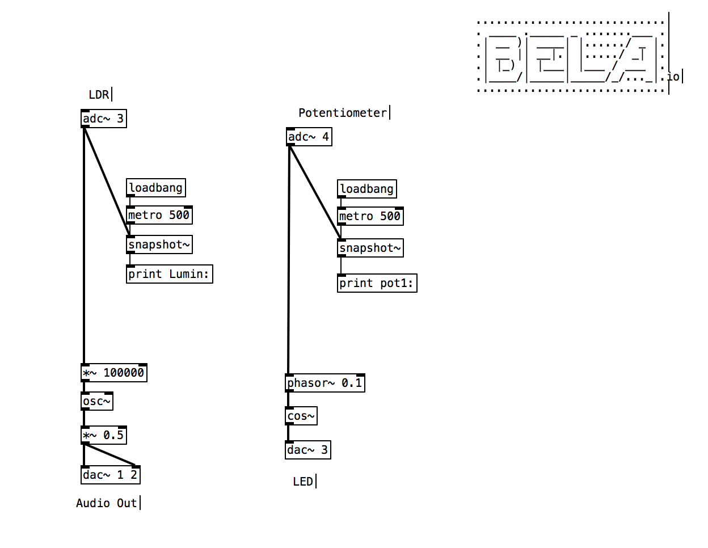

# BELA Workshop 1: Analog I/O
I denne workshop skal de studerende prøve kræfter med analoge inputs og outputs (i/o) på BELA boardet.

### BOM
- 1 x Pot
- 1 x LED
- 1 x LDR
- 1 x Breadboard
- 2 x resistors
- 10 x jumper wires
- 1 x BELA board
- (electrical tape)

## Analog Input
Der findes mange forskellige analoge input sensorer. Eksempler på disse er

- accelerometre
- pressure sensor
- light sensor
- sound sensors
- temperature sensors
- ...

I denne workshop anvendes potentiometre og LDR som analoge inputs.

Alle de kredsløb vi skal bygge sker vha. breadboards

### Potentiometer til BELA

- Byg et simpelt kredsløb med potentiometeret i forbindelse med BELA boardet
	- Identificer potentiometrets pinouts
	- Identificer hvor på boardet de forskellige pins fra potentiometret skal tilsluttes
- [Creating a Pd Project](https://github.com/L4COUR/BELA_Aarhus_Audiodesign/tree/main#creating-a-pd-project)
- download _main.pd og rediger i Pure Data
- overwrite filen på boardet med din egen fil

- [adc~ 3 4 5 6 7 8 9 10] = Bela's 8 analoge inputs.

- Anvend ovenstående objekter i pd for at logge værdier fra potentiometret til BELA's consol.
- Lav et system med BELA hvor et potentiometer bestemmer lydstyrken af en 440 hz sinus tone.

## Analog Output
Der findes mange forskellige analoge outputs sensorer. Eksempler på disse er

- LED
- motorer (servo, stepper etc.)
- solenoid
- DAC
- relay
- graphic displays (OLED, LCD etc.)
- ...

I denne workshop anvendes LED som det analoge output.

- Byg et simpelt kredsløb med LED i forbindelse med BELA boardet
- [Creating a Pd Project](https://github.com/L4COUR/BELA_Aarhus_Audiodesign/tree/main#creating-a-pd-project)
- download _main.pd og rediger i Pure Data
- overwrite filen på boardet med din egen fil
- [dac~ 3 4 5 6 7 8 9 10] = Bela's 8 analoge outputs.

## Vactroler

- En vactrol er en kombination af Light Dependent Resistors (LDR) og en lys kilde i en beskyttet lys-resistent kasse.
- Vactroler er anvendt i filtre, forstærkere, phaser, trigger delays, slew limiters, envelope generators, LFO'er og oscillatorer der eksempelvis i eurorack skal kunne kontrolleres gennem control voltage (CV) se [Doepfers side om vactroler](https://doepfer.de/a100_man/Vactrol.htm)
- Jeres erfaring fra hvordan man tilslutter BELA med dets analoge inputs og outputs kan bruges til at eksperimentere med vactroler.

### Vactrol oscillator

- Byg et kredsløb med LED og LDR koblet til BELA.
- [Creating a Pd Project](https://github.com/L4COUR/BELA_Aarhus_Audiodesign/tree/main#creating-a-pd-project)
- download _main.pd og rediger i Pure Data
- overwrite filen på boardet med din egen fil

- Overvej hvordan disse værdier kan bruges i forhold til at lave en oscillator, voice der skal komme ud af BELA's stereo output

- [andre workshops](./README.md)