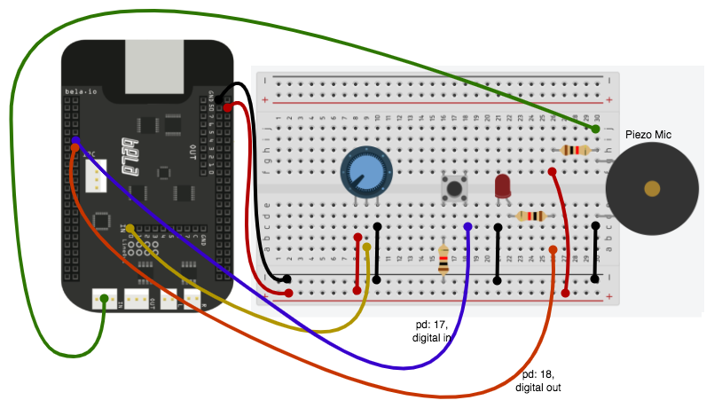

# BELA Workshop 3: Machine Listening
I denne workshop skal de studerende prøve kræfter med Audio inputs og outputs (i/o) på [BELA boardet](https://learn.bela.io/pin-diagram/).

### BOM
- piezo mic
- breadboard
- 2 x resistor
- button
- potentiometer
- 10 x jumper wires
- 1 x BELA board

## Audio input/output
lad os bygge et kredsløb med BELA hvorigennem vi kan optage lyd ved at holde en knap inde, og bruge et potentiometer til at sweepe igennem det optagede sample.

fra de foregående workshops skulle de studerende gerne kunne determinere hvordan de analoge og digitale input kontrol skal initiates.

anvend koden fra "pure data record sample" eksemplet i BELA's eksempler. (byt rundt på pd 17 og 18 i tegning for at få det til at matche eksemplet)

- overvej om vi kan bygge noget tilsvarende vha. cyclone?
- hvordan kunne pot, knap og led indtænkes på en ny måde i forhold til sketchen?

## Fremvisning af Morten Riis Paulstretch på BELA

## Hvad kan man videre arbejde med?
- kig selv videre på BELA's eksempler, overvej hvilke i kunne tænke jer at prøve kræfter med.
- prøv jer frem med at tilslutte BELA via MIDI
- prøv at se om i kan forbinde bela via OSC til Max/MSP, Overvej dets muligheder.
