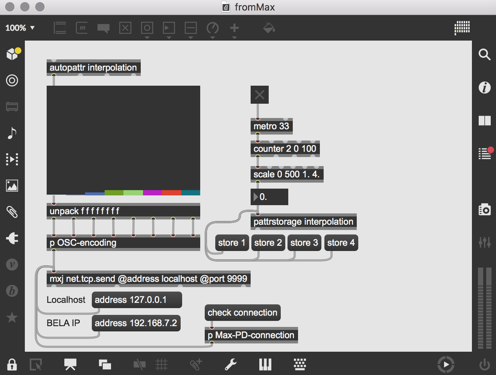

# BELA for Audiodesign

BELA for audiodesign handler om at give studerende på audiodesign kandidaten adgang til at anvende de muligheder BELA boardet giver adgang til, med de forudsætninger man som audiodesigner lære eller har lært gennem kurserne Digital Lyd og Lyd & Interaktion.

### Setting up BELA

- Grundlæggende forståelse af BELA
	- [Hvorfor anvende BELA?](https://github.com/L4COUR/BELA_Aarhus_Audiodesign/tree/main#hvorfor-anvende-bela)
	- [Hardware](https://github.com/L4COUR/BELA_Aarhus_Audiodesign/tree/main#hardware)
	- [Projekter lavet med BELA](https://github.com/L4COUR/BELA_Aarhus_Audiodesign/tree/main#projekter-lavet-med-bela)
	- [Setup BELA](https://github.com/L4COUR/BELA_Aarhus_Audiodesign/tree/main#setup-bela)
	- [Voltage Tolerances](https://github.com/L4COUR/BELA_Aarhus_Audiodesign/tree/main#voltage-tolerances)
	- [BELA Update & Troubleshooting](https://github.com/L4COUR/BELA_Aarhus_Audiodesign#bela-update--troubleshooting)
- [BELA and Pure Data](https://github.com/L4COUR/BELA_Aarhus_Audiodesign/tree/main#bela-and-pure-data)
	- [Libpd: Afvikling af Pd på BELA](https://github.com/L4COUR/BELA_Aarhus_Audiodesign/tree/main#libpd-afvikling-af-pd-p%C3%A5-bela)
	- [Creating a Pd Project](https://github.com/L4COUR/BELA_Aarhus_Audiodesign/tree/main#creating-a-pd-project)
	- [Audio I/O](https://github.com/L4COUR/BELA_Aarhus_Audiodesign/tree/main#audio-io)
	- [Analog I/O](https://github.com/L4COUR/BELA_Aarhus_Audiodesign/tree/main#analog-io)
	- [Digital I/O](https://github.com/L4COUR/BELA_Aarhus_Audiodesign/tree/main#digital-io)
	- [MIDI I/O](https://github.com/L4COUR/BELA_Aarhus_Audiodesign/tree/main#midi-io)
	- [Sensor processing in Pd](https://github.com/L4COUR/BELA_Aarhus_Audiodesign/tree/main#sensor-processing-in-pd)
	- [Abstractions](https://github.com/L4COUR/BELA_Aarhus_Audiodesign/tree/main#abstractions)
- [Cyclone on BELA](https://github.com/L4COUR/BELA_Aarhus_Audiodesign/tree/main#cyclone-on-bela)
	- [Installation af Cyclone på BELA](https://github.com/L4COUR/BELA_Aarhus_Audiodesign/tree/main#installation-af-cyclone-p%C3%A5-bela)
- [BELA and Max/MSP](https://github.com/L4COUR/BELA_Aarhus_Audiodesign#bela-and-maxmsp)
	- [UDP/OSC Communication](https://github.com/L4COUR/BELA_Aarhus_Audiodesign#udposc-communication)
	- [BELA to Max/MSP](https://github.com/L4COUR/BELA_Aarhus_Audiodesign#bela-to-maxmsp)
	- [Max/MSP to BELA](https://github.com/L4COUR/BELA_Aarhus_Audiodesign#maxmsp-to-bela)
- [Sources](https://github.com/L4COUR/BELA_Aarhus_Audiodesign#sources)

### Workshops
- [Workshop 1 Analog I/O](./BELA-Workshop-1_AnalogIO.md)

## Hvorfor anvende BELA?

Der findes mange microcontrollers der kan anvendes i en lydlig interaktiv sammenhæng. Fra [MakeyMakey](https://makeymakey.com/), [Arduino](https://www.arduino.cc/), [Teensy](https://www.pjrc.com/teensy/), [Raspberry Pi](https://www.raspberrypi.org/), [Axoloti](http://www.axoloti.com/), [Daisy](https://www.electro-smith.com/daisy), [BELA](https://bela.io/) og mange flere. Hvis du anvender BELA boardet fremfor de øvrige boards er det fordi du har brug for en robust og stabil platform der giver mulighed for "low-latency" interaktion.

BELA beskriver latency som "Action-to-sound" og sammenligner deres latency på under 1 ms med andre platforme som arduino-to-Max eller Arduino-to-RaspberryPi, [her](https://www.nime.org/proceedings/2016/nime2016_paper0005.pdf) kan du læse mere om Latency og dets betydning i interaktive lyd konfigurationer

Den lave latency skyldes måde hvorpå BELA's software er opsat på. Den lydlige del af BELA er højest prioriteret gennem deres specialbyggede audioprocesserings miljø baseret på XenMai real-time Linux udvidelse, der kan læses mere om [her](https://bela.io/about)

## Hardware

[BELA Pinout Detailed](https://learn.bela.io/pin-diagram/)

BELA består af 8 kanaler af 16-bit analoge I/O, 16 digitale I/O, Stereo audio I/O, og 2 indbyggede højtaler forstærkere.

## Projekter lavet med BELA

- [The Sound of Other Realities](https://blog.bela.io/prototyping-spatial-audio-for-AR-VR-with-bela/)
- [Opal Rhythm Computor by DMX Krew](https://blog.bela.io/opal-rhythm-computer-dmx-krew/)
- [Building an Audio Lightsaber with Bela](https://blog.bela.io/building-your-own-light-saber/)
- [Of Nature and Things](https://blog.bela.io/of-nature-and-things/)

- BELA har indtil videre været anvendt til at bygge

  - musik instrumenter
  - kinetiske skulpture
  - wearable devices
  - interactive lyd installationer
  - effekt bokse
  - sensor eksperimenter
  -  papir kredsløb
  - e-tekstiler

  ... og meget meget mere

## Setup BELA

- følg BELA's egen guide til at komme igang [her](https://learn.bela.io/get-started-guide/quick-start/)

- [Running projects on boot](https://learn.bela.io/using-bela/bela-techniques/running-projects-on-boot/)

### Step 1: Assemble and Plug in your hardware

- Indsæt [SD kort](https://learn.bela.io/using-bela/bela-techniques/managing-your-sd-card/) i BELA boardet
- Når du har forbundet BELA med computer med USB kabel skal du vente ca. 40 sekunder mens BELA booter op. Når BELA er klar vil dens blå LED blinke i et hjerteslagsbanken.
- Forbind headphones eller højtaler til BELA's Stereo out connecter med et audio adapter kabel.

#### Troubleshooting
follow BELA's guides on flashing SD cards and booting from SD.

- [BELA wont boot](https://learn.bela.io/get-started-guide/setting-up-your-hardware/#troubleshooting)
- [Flashing the BELA software](https://learn.bela.io/using-bela/bela-techniques/managing-your-sd-card/)
	- [Download and install Balena Etcher](https://www.balena.io/etcher/)
	- [Download the latest Bela software image](https://github.com/BelaPlatform/bela-image-builder/releases/)
- [Booting Bela from the SD card]()

### Step 2: Load BELA IDE

Audiodesigneren vil måske fra tidligere forløb på kurserne kende til [arduino's IDE](https://www.arduino.cc/en/software) hvori arduino kode skrives og compiles. [BELA's IDE](http://bela.local) køre gennem webbrowseren (anbefalet chrome) idet BELA genkendes af computeren som et USB netværks device.

- tjek om BELA's IDE er klar ved at åbne en webbrowser, og gå til "http://bela.local" hvis systemet er klar vil du se denne side.
  - 
- Hvis siden ikke loader skal du installere en driver se instruktioner for dit styresystem
  - [Max OS X](https://learn.bela.io/using-bela/bela-techniques/network-setup/#mac-os-x)
  - [Linux](https://learn.bela.io/using-bela/bela-techniques/network-setup/#linux)
  - [Windows](https://learn.bela.io/using-bela/bela-techniques/network-setup/#windows)

### Step 3: Build an example project

Når IDE er loadet i browser, åben eksempler ved at trykke på el-pæren. klik på eksemplet kaldet [sinetone](https://learn.bela.io/tutorials/c-plus-plus/fundamentals/sinetone/). Når eksemplet compiles vil det producere en 440Hz sinus tone. Koden kan ses i editoren, såvel som i projekts filer.

I toolbaren i den nederste del af skærmen, klik "Run". Hvis det er første gang du kører et projekt gennem BELA kan der godt gå et minuts tid hvor boardet skal opsætte nogle folder etc forend sinus tonen høres.

Når Run-knappen er grøn og drejer rundt så virker systemet korrekt og du bør høre en tone komme ud af audio outputet fra BELA.

Hvis du kan køre sinetone eksempel projektet og du høre en tone komme fra boardet, virker boardet som det skal,

### Step 4: turning off BELA

Det er vigtigt at man [slukker for BELA boardet](https://learn.bela.io/using-bela/bela-techniques/shutting-down-bela/) på den rigtige måde for ikke at ødelægge boardet.

på boardet er en dedikeret sluk knap for boardet

Boardet kan også slukkes fra BELA's IDE

## Voltage Tolerances

> Advarsel!!!
> ved anvendelse af digital I/O brug kun 3.3V da dette ellers vil skade BELA boardets CPU. Hver altid opmærksom når du anvender 5V med digitale inputs.

## BELA Update & Troubleshooting
- [Updating BELA guide](https://learn.bela.io/using-bela/bela-techniques/updating-bela/)
- [troubleshooting-guide](https://learn.bela.io/using-bela/about-bela/troubleshooting-guide/)

## BELA and Pure Data
> "Running Pure DATA on BELA, especially through the Heavy Audio Tools, provides a convenient graphical environment with minimal sacrifice in performance compared to programming in C++" - Moro et al. (2016)

Tidligere i jeres kandidat på audiodesign har i arbejdet med Max/MSP i forhold til digital lyd. De erfaringer i har gjort jer kan nemt oversættes til Pure Data. Dette skyldes at begge grafiske programmerings sprog er skabt af [Miller Puckette](https://futureofcoding.org/episodes/047.html).

De følgende sektioner vil dykke ned i Pure Data programmering med BELA med udgangspunkt I [BELA's PD guide](https://learn.bela.io/using-bela/languages/pure-data/).

### Libpd: Afvikling af Pd på BELA

libpd er et "linux library" der tillader at Pd's DSP-funktionalitet kan afvikles på BELA boardet. Pd afvikles "headless" på BELA boardet, dvs. at det kun audio dsp delen, uden den grafiske interface der reelt set afvikles.

Konsekvensen af denne form for afvikling betyder at man ikke kan skabe eller redigerer Pd patches i BELA's IDE. Istedet skal alt patching foregå ud fra følgende fremgangsmåde;

1. Lav og rediger Pd patch på PC/Mac
2. upload til [BELA IDE](http://bela.local)
3. Run op BELA
4. Hvis patching skal ændres da skal dette ske på PC/Mac for så igen at uploade en ny opdateret version til BELA igen.

fordelen ved at afvikle Pd patches gennem ovenstående metode er at alt kode kan kører på BELA boardet alene. Dette er ideelt i forhold til  afvikling af færdige lyd artefakter.

Dog kan det diskuteres hvorvidt man gennem ovenstående asynkrone workflow, er istand til at arbejde hurtigt og intuitivt med at skitsere komplekse digitale lyd prototyper.

### Creating a Pd Project
For at lave et nyt Pure Data projekt, gå til **Project Explorer** tab. Klik på **Create New Project** knappen i toppen, og i dialog boksen, vælg **Pure Data**, giv dit projekt et navn, og klik **Create project**.

I det tomme Pd BELA projekt eksisterer kun en fil kaldet **_main.pd** Din hovede patch til dit project skal altid være navngivet **_main.pd**. Du kan have andre Pd komponenter, men kerne-patchen skal altid være navngivet dette.

[Pure Data Reference Card](https://puredata.info/docs/tutorials/pd-refcard)

### Audio I/O

- [adc~ 1 2] = BELA's stereo inputs 
- [dac~ 1 2] = BELA's stereo output

### Analog I/O

- [adc~ 3 4 5 6 7 8 9 10] = Bela's 8 analoge inputs.

- [dac~ 3 4 5 6 7 8 9 10] = Bela's 8 analoge outputs.

### Digital I/O

Enhver digitalPin kan fungere som både et input og et output, hvilket betyder at en pin's mode skal specificeres som enden (HIGH eller LOW)

- De digitale I/O pins initialiseres ved at sende beskeder til **bela_setDigital**.

- pins 0-16 er nummererede fra 11-26 som det fremgår af [pin diagrammet](https://learn.bela.io/pin-diagram/).

### MIDI I/O

- De fleste USB MIDI devices er compatible med BELA.
- Anvend [notein] og [ctlin] objekter for at modtage midinote og CC messages fra disse devices.
- Følg "Hello Midi" eksemplet i BELA IDE
- Lær hvordan BELA kan anvendes som MIDI-to-CV converter.

Når BELA er forbundet via USB med din PC/Mac findes den som MIDI device, og kan tilgåes via en DAW og kan således anvendes til at kontrollerer VSTs etc.

### Sensor processing in Pd

- Smoothing
	- Anvendelse af lowpass filter for at reducere højfrekvent støj fra sensor-data. 
- Re-centering
	- Nogle sensores output såsom accelerometre er iboende DC-offset(unipolar), for at gøre ouputet bipolart kan et highpass filter anvendes.
- Differentiating
	- nogle lyd-generatore parametre bør kontrolleres genem velocity af en sensor fremfor en raw reading. Et highpass filter med cut-off frekvens på 0, kan reskaleret anvendes til dette formål.
- Thresholding
	- gennem en kombination af full-wave rectification, smoothing, DC shift og threshold kan et signal også gøres mindre støjende eller jittery.

### Abstractions
BELA Pd's **Abstractions** kan opfattes som **Snippets** i Max/MSP. Abstractions er Pd patches der er genanvendelige på tværs af flere Pd projekter.

for at kunne anvende abstractions skal der laves et Pd projekt kaldet **pd-externals**. Enhver abstraction der slutter med .pd og externals der slutter med .pd_linux lokaliseret i pd-externals folderen kan tilgåes fra alle øvrige Pd projekter.

## Cyclone on BELA
Selvom mange af de objekter der findes i Pd har tilsvarende objekter i Max/MSP, så er der mange objekter fra Max/MSP der ikke har tilsvarende objekter i Pd. Pure Data librariet [cyclone](https://github.com/porres/pd-cyclone) indeholder Pd versioner af Max/MSP objekter der gør det nemmere for audiodesignerne at udnytte deres erfaring fra tidligere fag.  

### Installation af Cyclone på BELA

1. Opret **pd-externals** folder på BELA, og downloade følgende filer der er nødvendige for at kunne compile cyclone på Bela via følgende Terminal/CMD commands
`git clone https://github.com/giuliomoro/pure-data &&\`
`cd pure-data &&\`
`scp src/*h root@192.168.7.2:/usr/local/include/libpd/`

2. herefter ssh ind i Bela via Terminal/CMD command
`ssh root@192.168.7.2 mkdir -p Bela/projects/pd-externals`

3. Download [Cyclone v0.3, RC-1 source code](https://github.com/porres/pd-cyclone/archive/cyclone0.3rc1.zip) til din Desktop, idet BELA boardet kører Pd 0.48-2.
4. uncompress .zip filen på Desktop til en **pd-cyclone-cyclone0.3rc1**
5. Åben en Terminal/CMD, naviger til  Desktop via følgende command
`cd ~/Desktop`
6. kopier folderen til BELA
`scp -r pd-cyclone-cyclone0.3rc1 root@192.168.7.2: `
7. ssh ind i BELA og gå derefter ind i cyclone folderen
`ssh root@192.168.7.2 `
`cd pd-cyclone-cyclone0.3rc1/`
8. Compile Cyclone, dette kan tage op til 10 min, og måske printe warnings, men det skulle ikke have nogen indflydelse i sidste ende
`make PDINCLUDEDIR=/usr/local/include/libpd`
9. efter Cyclone er compiled, kan cyclones externals installeres til **pd-externals** folderen
`make PDLIBDIR=/root/Bela/projects/pd-externals install`
10. Tjek at cyclone externals (med **.pd_linux**) er installeret
` ls ~/Bela/projects/pd-externals/cyclone`
11. Test at Cyclone er korrekt installeret på BELA ved at uploade en patch lig nedenstående

I forhold til yderligere guides til installation af andre externals tjek [BELA's Forum](https://forum.bela.io/d/101-compiling-puredata-externals/100)  

## BELA and Max/MSP

Hvis ikke Pd cyclone's utallige objekter er tilstrækkeligt, kan man forbinde Max/MSP via UDP/OSC fra en computer på samme netværk som BELA boardet. Ulempen ved en sådan afvikling;

- "Action to Sound" vil forøges afhængig af netværkets hastighed, resultere i ringere latency.
- Lydobjektet eller prototypen mister selvstændighed og mobilitet.
- Debugging bliver sværere.

Fordelen ved en sådan afvikling;

- Adgang til Max/MSPs endeløse funktionalitet og grafisk interfaces
- Anvende tidligere erfaring med Max/MSP

### UDP/OSC & TCP/FUDI Communication
UDP og OSC kommunikations protokollerne tillader anvendelsen af en normal ethernet netværks forbindelse til at sende information mellem computere og andre interaktive medie systemer. pga. af dets hastighed og tilgængelighed i næsten enhver ny computer er den en god kandidat til at kunne erstatte MIDI interfaces i mange tilfælde.

OSC er en forkortelse for Open Sound Control. I de fleste tilfælde er OSC endnu et lag af UDP forbindelser som en standardiseret måde at overføre information mellem systemer.

- UDP er i stand til at overføre flere blokke af data via ethernet forbindelse. 
- Måden hvorpå data er organiseret sker gennem OSC som et yderligere lag.

Pure Data kan kun forbindes med UDP med mindre man installerer externals der gør det muligt at modtage og sende OSC. Pd Netsend/Netreceive objekter anvender default en ældre udgave af UDP kaldet [TCP/FUDI](https://en.wikipedia.org/wiki/FUDI).

Som de følgende eksempler viser kan data sendes fra BELA til Max/MSP vha. UDP. Dog er dette ikke tilfældet i forhold til at sende data den anden vej. Hvis vi ikke installerer externals til Pd, kan Max/MSP kun sende beskeder via TCP/FUDI protokollen
 

### BELA to Max/MSP
Infrastruktur for at sende data fra BELA til Max/MSP. Se [video demonstration](https://vimeo.com/680066219?activityReferer=1)

1. Følg guide for at lave et Pd project
2. Rediger **_main.pd** til at sende data via **netsend** objektet

3. Idet vi ønsker at kommunikere fra BELA til Max/MSP skal vi bruge "BELA host computer"-ip addresse der altid er 192.168.7.1, og kan findes i netværks systemindstillingerne. indsæt denne Ip i **connect** beskeden til **netsend** objektet.

4. lav en Max patcher til at modtage data via **udpreceive** objektet

5. Byg et hardware setup med to analoge input componenter og forbind deres data kabler til analog in pin 0 og 1 på BELA boardet.

### Max/MSP to BELA
infrastruktur for at sende data fra Max/MSP til BELA
Se [video demonstration](https://vimeo.com/680240041)

1. Følg guide for at lave et Pd project
2. Rediger **_main.pd** til at modtage data via **netreceive** objektet

	3. Idet vi ønsker at kommunikere fra Max/MSP til BELA skal vi nu bruge ["BELA boardets"-ip addresse](https://forum.bela.io/d/498-basic-netsend-netreceive/12) der altid er 192.168.7.2, sikre dig at denne er indstillet til korrekt i din Max patcher.
4. lav en Max patcher til at sende data via **mxj net.tcp.send** objektet

5. Byg et hardware setup med otte analoge output componenter og forbind deres data kabler til analog out pin 0 1 2 3 4 5 6 7 på BELA boardet.

## Sources

- [PD for Max/MSP Users](https://puredata.info/docs/tutorials/PdForMaxUsers)
- [BELA Quickstart](https://learn.bela.io/get-started-guide/quick-start/)
- [BELA Pure Data](https://learn.bela.io/using-bela/languages/pure-data/)
- [Artikel om BELA and Pure Data](https://qmro.qmul.ac.uk/xmlui/bitstream/handle/123456789/12653/Moro%20Making%20High-Performance%20Embedded%202016%20Accepted.pdf?sequence=1&isAllowed=y)
- [BELA Pure Data Externals](https://forum.bela.io/d/101-compiling-puredata-externals/98)
- [Send/receive Data from Running PD on BELA](https://github.com/jarmitage/bela.pd)
- [Miller Puckette Max/MSP & Pure Data](https://futureofcoding.org/episodes/047.html)
- [UDP & OSC kommunikation](https://frieder-weiss.de/eyecon/Manual/udp-osc.htm)
- [PdPortNPM.js](https://npm.io/package/port)
- [BELA basic send receive](https://forum.bela.io/d/498-basic-netsend-netreceive/12)
